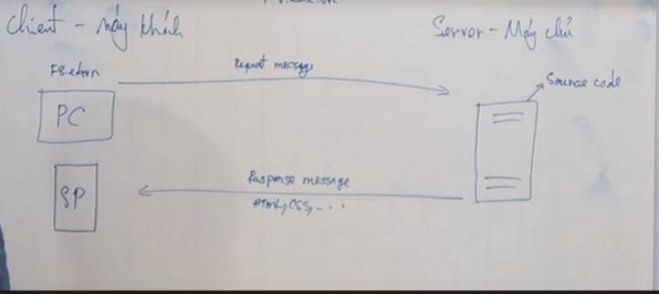

# Buổi 1: HTML

Created by: B21DCCN244 - Nguyễn Anh Đức
Created time: May 19, 2023 1:51 PM
Last edited by: B21DCCN244 - Nguyễn Anh Đức
Last edited time: May 19, 2023 7:32 PM
Tags: Docs

## CÁC KIẾN THỨC CƠ BẢN VỀ HTML

### 1. Cách thức hoạt động của một trang web

Toàn bộ các website hiện này thì đều sử dụng mô hình `Client - Server` để triển khai

⇒ Vậy thì mô hình `Client - Server` là gì 

<aside>
💡 là mô hình giúp các máy tính giao tiếp, truyền tải dữ liệu cho nhau

</aside>

Lấy ví dụ về mô hình *`Client - Server`*

Có hai máy tính: bên **Client** <máy khách> và bên **Server**<máy chủ>

**Máy khách** thường là máy tính cá nhân <PC>, smartphone<coi như máy tính thu nhỏ> có thể truy cập internet

**Máy chủ** là loại máy được thiết kế đặc biệt để chạy 24/7, được đặt ở phòng máy lạnh, được quang hoá đến tận cả mang lan, nó được thiết kế để có thể tháo lắp các linh kiện sống: ví dụ có thể lắp nhiều CPU, or tháo bỏ bớt CPU ra thì nó vẫn chạy bthuong, ram cũng vậy

100 ông client có thể truy cập đến 1 ông server, cái ông server này có thể là máy tính của mình nma nó sẽ chạy chậm hơn, ko thể chạy 24/7, dễ bị hỏng hơn

Về Vai trò: Client và server có nhiệm vụ và vai trò khác nhau ⇒ dựa vào vai trò thì ta mới biết được đâu là client, đâu là server 

**Nhiệm vụ của ông máy chủ** : lưu giữ liệu mà chúng ta viết ra: các file html, css, …< tóm gọn lại thì đó là `source code`>

Khi bạn muốn truy cập vào một trang web nào đó<ví dụ codeptit.edu.vn> thì máy tính cá nhân, hay ông **client** sẽ gửi một cái `request message` tới ông **server** ⇒ khi đó ông máy chủ sẽ tiếp nhận và xử lý và nó sẽ trả về cái `source code` mà nó đang lưu trữ<html, css, ..> ngược về cho client ⇒ cái việc trả về này nó gọi là `response`<phản hồi> massage <mang theo mã sourve code> và client của mình có cái trình duyệt browser, trình duyệt nhận được `response` thì sẽ `render` ra website của chúng ta

<aside>
💡 Nói chung là: Tiếp nhận yêu cầu, xử lý và gửi đi phản hồi response thì nó là ông server

                      Còn ông client là ông gửi yêu cầu <request> đi mà thoi

</aside>



Có thể cấu hình ngược lại: nếu đứng ở phía to to gửi request thì nó là client còn ông kia gửi response thì ông đó lại là server

⇒ đó là tổng quan website nó hoạt động

Trong thực tế, thường thường với website nhỏ, mình thường cài 1 cái gọi là webserver<nginx, apache> đây là phần mềm chạy webserver 

mỗi khi chạy 1 website thì cần 1 phần mềm ⇒ phần mềm đó được gọi là webserver

<mới web nhỏ thì thường sẽ cài thêm cả phần backend, và database<lưu trữ dữ liệu>>

máy client là máy gửi yêu cầu

máy server là máy tiếp nhận, xử lý và gửi phản hồi cho client

và client thì ko phải lúc nào cùng duy trì connect với mấy chủ, còn máy chủ luôn ở trạng thái sẵn sàng, luôn sẵn sàng nhận yêu cầu


## 2. Cấu trúc của HTML

1. Khải niệm
    - HTML là chữ viết tắt của cụm từ HyperText Markup Language (ngôn ngữ đánh dấu siêu văn bản)
    - HTML dùng để tạo ra các trang web, những nội dung mà chúng ta nhìn thấy trên trang web (chẳng hạn như: văn bản, hình ảnh, âm thanh, video, . . . .) chính là những thứ được xây dựng dựa trên các thẻ HTML
    
2. Cấu trúc của HTML
    
    Đặt tên file đầu tiên là `index.html` bởi vì khi sau này đăng tải website lên hosting thì đa phần các hosting được cấu hình mặc định tự động truy cập vào file `index`, dùng file này để code trang chủ của website
    
    
    
    - Đầu tiên khi viết một chương trình html thì ta phải khai báo phần `!DOCTYPE` cho nó
        
        <Doc: document, type: loại ⇒ định nghĩa loại tài liệu này là html> 
        
        
        
    
    - Thẻ `tag`
        
        <aside>
        💡
        
        - Thẻ `tag` là một từ khoá được đặt bên trong cặp dấu ngoặc nhọn.
            
            từ khóa
            
        - Mỗi thẻ sẽ có một chức năng riêng, ví dụ:
            - Thẻ `<p>` dùng để tạo một đoạn văn bản.
            - Thẻ <a> dùng để tạo một cái liên kết.
            - Thẻ  dùng để chèn một tấm hình vào trang web.
            - . . . .
        - Thông thường thì  được chia ra làm hai loại chính, đó là: `thẻ kép` & `thẻ đơn`
        
        </aside>
        
        - Thẻ kép
            
            
            
        - Thẻ đơn
            
            
            
        - Thẻ lồng nhau
            
            
            
    
    
    
    Đây là một cặp thẻ đóng mở
    
    - Thẻ đóng khác thẻ mở ở chỗ là nó có thêm dấu / trước tên thẻ
    
    > Cặp thẻ html này nó sẽ chứa tất cả nội dụng website của chúng ta và một file html thì chỉ có 1 cặp thẻ html
    > 
    
    Trong thẻ `html` sẽ bao gồm hai phần là phần đầu `head` và phần thân `body`
    
    
    
    
    
    ```html
    <!DOCTYPE html>
    <html>
    	<head>
    		<title>Hello WEB CƠ BẢN</title>
    		<meta charset="utf-8">
    	</head>
    	<body>
    		`<p>`1) Tài liệu học HTML</p>
    		`<p>`. . . . . . . . . . . . . . . . . . . . . . . . . . . . .</p>
    		`<p>`2) Tài liệu học CSS</p>
    		`<p>`. . . . . . . . . . . . . . . . . . . . . . . . . . . . .</p>
    		`<p>`3) Tài liệu học JavaScript</p>
    		`<p>`. . . . . . . . . . . . . . . . . . . . . . . . . . . . .</p>
    	</body>
    </html>
    ```
    
    
    
    ### CÁCH COMMENT CODE TRONG HTML
    
    Công dụng: dùng để comment code + vô hiệu hoá đoạn code đã viết 
    
    sử dụng cú pháp ```<!-- -->``` 
    
    or sủ dụng phím tắt: CTRL + / 
    

## 3.  Block-level vs inline HTML elements và phân biệt div và span

<aside>
💡 Trong HTML, nếu xét về đặc điểm hiển thị thì các phần tử sẽ được chia ra làm hai loại chính:

- Phần tử khối (`Block element`)
- Phần tử nội tuyến (`Inline element`)
</aside>

1. Phần tử khối là gì?
    
    Phần tử khối là phần tử mà khi hiển thị lên màn hình thì nó sẽ có những đặc điểm như sau:
    
    - Luôn luôn được bắt đầu trên một hàng mới.
    - Chiều rộng của phần tử sẽ chiếm toàn bộ chiều rộng phần nội dung của phần tử cha của nó.
    
    
    
    
    
    Chú ý: 
    
    <aside>
    💡
    
    - Thông thường, một phần tử có thể được lồng vào bên trong "phần nội dung" của một phần tử khác.
    - Trong đó:
        - Phần tử mà nội dung của nó có chứa phần tử khác thì được gọi là phần tử cha
        - Phần tử được lồng vào bên trong nội dung của phần tử khác thì được gọi là  phần tử con
    </aside>
    
    Ví dụ
    
    ```html
    <!DOCTYPE html>
    <html>
    <head>
    	<title>Tiêu đề của trang web</title>
    	<meta charset="utf-8">
    </head>
    <body>
    	`<u>`Phần tử khối là gì !?`</u>`
    	<i>Phần tử nội tuyến là gì !?</i>
    	`<p>`Điểm khác nhau giữa phần tử khối và phần tử nội tuyến</p>
    	`<s>`block element & inline element</s>
    	<h3>Cách tạo một cái phần tử khối trong HTML</h3>
    </body>
    </html>
    ```
    
    
    
    Để giúp các bạn dễ nhận ra đặc điểm hiển thị của các phần tử phía trên thì mình sẽ thiết lập màu nền cho chúng.
    
    
    
    Sau khi xem xong phần minh họa phía trên thì chúng ta thấy hai phần tử `<p>` và <h3> đều được bắt đầu trên một hàng mới, chiều rộng của chúng chiếm toàn bộ chiều rộng phần nội dung của phần tử cha của chúng. Cho nên, hai phần tử này chính là `phần tử khối`.
    
2. Phần tử nội tuyến là gì?
    - Phần tử nội tuyến là loại phần tử mà khi hiển thị lên màn hình thì nó sẽ có các đặc điểm như sau:
        - Phần tử hiển thị tiếp nối trên hàng hiện tại (nếu anh của nó không phải là một phần tử khối)
        - Chiều rộng của phần tử phụ thuộc vào kích cỡ của nội dung nằm ở bên trong nó.
    
    ```html
    <!DOCTYPE html>
    <html>
    <head>
    	<title>Tiêu đề của trang web</title>
    	<meta charset="utf-8">
    </head>
    <body>
    	`<p>`Điểm khác `<b>`giữa</b> `<s>`phần tử khối</s> và `<u>`phần tử nội tuyến`</u>`</p>
    	<i>Phần tử khối là gì !?</i>
    	<h3>Cách tạo một cái phần tử khối trong HTML</h3>
    </body>
    </html>
    ```
    
    
    
    
    
    - Sau khi xem xong phần minh họa phía trên thì chúng ta thấy ba phần tử `<b>`, `<s>`, `<u>` đều hiển thị tiếp nối trên hàng hiện tại, chiều rộng của chúng phụ thuộc vào kích cỡ của các nội dung nằm ở bên trong chúng. Cho nên, ba phần tử này chính là phần tử nội tuyến.
    - : Phần tử <i> cũng là một phần tử nội tuyến, nguyên nhân mà nó không được hiển thị tiếp nối trên hàng hiện tại là bởi vì phần tử anh của nó là một phần tử khối.
        
        Phần tử h3 là một phần tử khối nên nó sẽ ko viết tiếp sau phần tử nội tuyến, và nó sẽ bắt đầu dòng mới luôn
        
3. Phân biệt `Div` và `Span`
    - `Div`
        
        - Phần tử <div> là một `phần tử khối`, mặc định thì phần tử khối này không có bất kỳ một định dạng gì, cho nên nó thường được dùng để làm thùng chứa cho các phần tử khác.
        
        Ví dụ:
        
        ```html
        <!DOCTYPE html>
        <html>
        <head>
        	<title>Tiêu đề của trang web</title>
        	<meta charset="utf-8">
        </head>
        <body>
        	<div>
        		`<u>`Cách sử dụng phần tử div`</u>`
        		<i>Cách sử dụng phần tử span</i>
        		`<p>`Điểm khác giữa phần tử div và phần tử span</p>
        		<h3>Tìm hiểu chức năng của phần tử div và phần tử span</h3>
        	</div>
        </body>
        </html>
        ```
        
        Đặt bốn phần tử `<u>`, <i>, `<p>`, <h3> nằm bên trong phần tử <div>
        
        Trong đó `<u>`, <i> là 2 phần tử nội tuyến
        
        còn `<p>` và <h3> là 2 phần tử khối
        
        
        
        việc chúng ta có đặt bốn phần tử `<u>`, <i>, `<p>`, <h3> bên trong phần tử <div> hay không thì cũng không ảnh hưởng gì đến bốn phần tử này, bởi vì mặc định phần tử <div> không có bất kỳ một định dạng nào cả.
        
        Tuy nhiên chúng ta cần đặt trong phần tử <div> để: 
        
        - Tiện cho việc định dạng
            
            ```html
            <!DOCTYPE html>
            <html>
            <head>
            	<title>Xem ví dụ</title>
            	<meta charset="utf-8">
            </head>
            <body>
            	`<u>`Phần tử div trong HTML`</u>`
            	<i>Phần tử span trong HTML</i>
            	`<p>`Cách sử dụng phần tử div để thiết kế bố cục trang web</p>
            	`<s>`Nhóm các phần tử vào bên trong phần tử div</s>
            </body>
            </html>
            ```
            
            Giờ ta muốn thiết lập kích cỡ chữ 30 pixel cho tất cả các phần tử ở phía trên, thay vì phải định dạng từng phần tử thì tôi sẽ đặt chúng vào một phần tử <div> rồi định dạng cho phần tử <div>
            
            ```html
            <!DOCTYPE html>
            <html>
            <head>
            	<title>Xem ví dụ</title>
            	<meta charset="utf-8">
            </head>
            <body>
            	<div style="font-size:30px">
            		`<u>`Phần tử div`</u>`
            		<i>Phần tử span</i>
            		`<p>`Sử dụng phần tử div để thiết kế bố cục trang web</p>
            		`<s>`Nhóm các phần tử vào bên trong phần tử div</s>
            	</div>
            </body>
            </html>
            ```
            
            [demo vi du](https://webcoban.vn/html/demo?file=3450)
            
        - Để thiết kế bố cục cho trang web
            
            
            
            Để thiết kế một trang web có bố cục ba phần giống như minh họa ở phía trên thì chúng ta cần phải sử dụng ba phần tử <div> để tạo ba khối riêng biệt.
            
            ```html
            <!DOCTYPE html>
            <html>
            <head>
            	<title>Xem ví dụ</title>
            	<meta charset="utf-8">
            </head>
            <body>
            	<div id="header">
            		<h2>WEB CƠ BẢN</h2>
            		`<p>`(TRANG CHIA SẺ TÀI LIỆU HỌC LẬP TRÌNH WEB MIỄN PHÍ)</p>
            	</div>
            	<div id="content">
            		<h3>`<u>`BÀI HƯỚNG DẪN SỐ 2`</u>`</h3>
            		`<p>`. . . . . . . . . . . . . . . . . . .</p>
            	</div>
            	<div id="footer">Thông tin bản quyền</div>
            </body>
            </html>
            ```
            
            [demo file](https://webcoban.vn/html/demo?file=3451)
            
    - `Span`
        
        Phần tử <span> là một phần tử nội tuyến, mặc định thì phần tử nội tuyến này không có bất kỳ một định dạng gì, cho nên nó thường được dùng để làm thùng chứa cho những phần tử nội tuyến khác (chủ yếu là văn bản) để định dạng.
        
        ```html
        <!DOCTYPE html>
        <html>
        <head>
        	<title>Xem ví dụ</title>
        	<meta charset="utf-8">
        </head>
        <body>
        	`<p>`- Tài liệu <span style="font-size:30px">học</span> HTML</p>
        	`<p>`- Từ <span style="color:red">cơ bản</span> đến nâng cao</p>
        </body>
        </html>
        ```
        
    
    [demo](https://webcoban.vn/html/demo?file=3452)
    

## 4. Các thẻ liên quan đến table trong HTML

Thông thường, để tạo được một cái bảng thì chúng ta cần phải sử dụng bốn loại thẻ:

<table> :      • Thẻ <table> dùng để xác định một cái bảng.

---

<tr>:             • Thẻ <tr> dùng để xác định một hàng bên trong bảng.

---

<th>:           • Thẻ <th> dùng để xác định một ô (tiêu đề) bên trong hàng.

---

<td>:           • Thẻ <td> dùng để xác định một ô (bình thường) bên trong hàng.

---

Hình ảnh Ví dụ: 


Lưu ý: Ô tiêu đề là loại ô mà văn bản nằm bên trong nó mặc định được tô đậm & canh giữa.

# Cách thức thể tạo một bảng

Để tạo một cái bảng thì chúng ta nên thực hiện lần lượt các bước như sau:

- Bước 1: Xác định một cái bảng.
- Bước 2: Xác định số hàng nằm bên trong bảng.
- Bước 3: Xác định số ô nằm bên trong mỗi hàng.
- Bước 4: Xác định nội dung của từng ô.
- Bước 5: Thiết lập thuộc tính border với giá trị 1 để tạo đường viền cho bảng và các ô.


Dưới đây là danh sách một số thuộc tính thường được áp dụng trong việc tạo bảng.


[Tim hiểu thêm ở đây](https://webcoban.vn/html/cach-tao-bang-table-trong-html.html)

## 5. Các thẻ: image, video, links, audio

- Image
    
    Để chèn một tấm hình vào bên trong trang web thì chúng ta thêm thẻ  nằm ở ngay vị trí mà mình muốn hình ảnh được hiển thị, cú pháp như sau:
    
    <aside>
    💡 
    
    </aside>
    
    
    
    Lưu ý: Khi chúng ta chèn một tấm hình vào bên trong trang web thì mặc định tấm hình sẽ được hiển thị với kích thước bằng kích thước gốc của nó.
    
    <aside>
    💡 - Nếu muốn thiết lập lại kích thước hiển thị của tấm hình trên trang web thì chúng ta cần phải sử dụng thuộc tính width và thuộc tính height
    
    </aside>
    
    [xem chi tiết tại đây](https://webcoban.vn/html/cach-chen-hinh-anh-vao-trang-web-html.html)
    
- Video
    
    Để chèn một đoạn video vào trang web thì chúng ta sử dụng cú pháp như sau:
    
    ```html
    <video controls>
    	<source src="đường dẫn đến tập tin video">
    </video>
    
    Ví dụ: 
    <video controls>
    	<source src="../file/bunny.mp4">
    </video>
    ```
    
    [demo ví dụ](https://webcoban.vn/html/demo?file=3382)
    
    - Lưu ý: Chúng ta nên sử dụng nhiều thẻ <source> để xác định nhiều tập tin video dự phòng (đề phòng trường hợp đường dẫn đến tập tin video này không tồn tại thì trình xem phim sẽ chuyển sang sử dụng đường dẫn đến một tập tin video khác)
    
    
    
    [demo ví dụ](https://webcoban.vn/html/demo?file=3641)
    
    Dưới đây là danh sách những thuộc tính thường được sử dụng bên trong thẻ <video>
    
    
    
    [xem phần nâng cao hơn ở đây](https://webcoban.vn/html/cach-chen-mot-doan-phim-video-vao-trang-web.html)
    
- Links
    
    Trong trang web, liên kết là những nội dung (thường được đại diện bởi văn bản hoặc hình ảnh) mà khi chúng ta nhấp vào nó thì chúng ta sẽ được chuyển đến một tài liệu khác.
    
    Để tạo một cái liên kết thì chúng ta dùng cú pháp như sau:
    
    < chúng ta sẻ sử dụng thẻ a>
    
    ```html
    <a href="URL">nội dung đại diện cho cái liên kết</a>
    
    Trong đó: 
    	URL là đường dẫn đến tài liệu mà các bạn muốn người dùng sẽ được chuyển đến.
    	Nội dung đại diện cho cái liên kết có thể là văn bản hoặc hình ảnh.
    ```
    
    ví dụ: 
    
    ```html
    <!DOCTYPE html>
    <html>
    	<head>
    		<title>Cách tạo liên kết trong html</title>
    		<meta charset="utf-8">
    	</head>
    	<body>
    		<a href="http://webcoban.vn/image/hugo.jpg">Click here</a>
    		<br><br>
    		<a href="https://www.facebook.com"></a>
    	</body>
    </html>
    ```
    
    [demo ví dụ](https://webcoban.vn/html/demo?file=3192)
    
    [Kiến thức nâng cao nằm ở đây](https://webcoban.vn/html/cach-tao-mot-cai-lien-ket-link-trong-html.html)
    
- Audio
    
    Để chèn một đoạn audio vào trang web thì chúng ta sử dụng cú pháp như sau:
    
    ```html
    <audio controls>
    	<source src="đường dẫn đến tập tin audio">
    </audio>
    
    ví dụ: 
    <audio controls>
    	<source src="../file/bell.mp3">
    </audio>
    
    ```
    
    [demo ví dụ](https://webcoban.vn/html/demo?file=3392)
    
    - Lưu ý: Chúng ta nên sử dụng nhiều thẻ <source> để xác định nhiều tập tin audio dự phòng (đề phòng trường hợp đường dẫn đến tập tin audio này không tồn tại thì trình nghe nhạc sẽ chuyển sang sử dụng đường dẫn đến một tập tin audio khác)
    
    
    
    Dưới đây là danh sách những thuộc tính thường được sử dụng bên trong thẻ <audio>
    
    
    

## 6. Section elements: div, span, header, footer, nav, main, section, article

- Header
    
    Trong HTML5, thẻ header được dùng để khai báo phần đầu (*tiêu đề*) cho các bài viết<article>, thậm chí là phần trên cùng của trang web
    
    ```html
    <header>...</header>
    ```
    
    ví dụ làm phần đầu cho article
    
    
    
    
    
    Bạn cũng có thể sử dụng header để khai báo phần trên cùng (*chứa logo và các thông tin cơ bản khác*) của trang web
    
- Article
    
    **Article** là một thẻ HTML được dùng để khai báo cấu trúc cho các bài viết sẽ hiển thị lên trang web.
    
    Thường được sử dụng trong:
    
    - Tin tức.
    - Comment.
    - Nội dung quảng cáo.
    
    ```html
    <article>   </article>
    ```
    
    ```html
    <section id="layout">
        <header>
            HEADER
    
            <nav>
                <ul>
                    <li><a href="#">Trang chủ<a></li>
                    <li><a href="#">Giới thiệu<a></li>
                    <li><a href="#">Sản phẩm<a></li>
                    <li><a href="#">Liên hệ<a></li>
                </ul>
            </nav>
        </header>
    
        <section id="pageBody">
            <section id="content">
                CONTENT
                <article>ARTICLE</article>
            </section>
    
            <aside>ASIDE</aside>
        </section>
    
        <ul>
            <li>BOX 1</li>
            <li>BOX 2</li>
            <li>BOX 3</li>
            <li>BOX 4</li>
        </ul>
    
        <footer>FOOTER</footer>
    </section>
    ```
    
    
    
- Footer
    - Tag <footer> định nghĩa khu vực footer (phần cuối) của trang.
    - Thường chứa các thông tin liên lạc của tác giả, nguồn gốc của bài viết.
    
    ```html
    <footer>  </footer>
    ```
    
- Nav
    - Tag <nav> định nghĩa liên kết điều hướng (navigation).
    - Tag <nav> thường sử dụng cho global menu, local link, topic path, pager link,...
    - Nội dung bên trong <nav> thường là một danh sách <ul> hoặc <ol>.
    
    ```html
    <nav>
        <ul>
            <li><a href="#">Trang chủ<a></li>
            <li><a href="#">Giới thiệu<a></li>
            <li><a href="#">Sản phẩm<a></li>
            <li><a href="#">Liên hệ<a></li>
        </ul>
    </nav>
    ```
    
- Main
    
    Thẻ <main> chỉ định nội dung chính của tài liệu.
    
    Nội dung bên trong phần tử <main> phải là duy nhất cho tài liệu. Nó không được chứa bất kỳ nội dung nào được lặp lại trên các tài liệu như thanh bên, liên kết điều hướng, thông tin bản quyền, logo trang web và biểu mẫu tìm kiếm.
    
    Lưu ý: Không được có nhiều hơn một phần tử <main> trong một tài liệu. Phần tử <main> KHÔNG được là phần tử con của phần tử <article>, <aside>, <footer>, <header> hoặc <nav>.
    
    
    
- Section
    
    Tag <section> định nghĩa một khu vực (vùng bao) trong văn bản HTML.
    
    Tag <section> bên trong thường chứa một <hx> và nội dung.
    
    ```html
    <section>
    <h2>Tiêu đề section</h2>
    ...
    </section>
    ```
    

## 7. HTML text fundamentals: h1 -> h6, p, ul, li

- Thẻ Tiêu đề(heading)
    
    
    
    
    
    ```html
    <!DOCTYPE html>
    <html>
    <head>
    	<title>Xem ví dụ</title>
    	<meta charset="utf-8">
    </head>
    <body>
    	<h1>Heading 1</h1>
    	<h2>Heading 2</h2>
    	<h3>Heading 3</h3>
    	<h4>Heading 4</h4>
    	<h5>Heading 5</h5>
    	<h6>Heading 6</h6>
    </body>
    </html>
    ```
    
- Thẻ p
    
    Để tạo được một đoạn văn bản thì chúng ta cần phải sử dụng thẻ `<p>`
    
- Danh sách <list>
    
    
    
    ****Cách tạo danh sách có thứ tự <sử dụng thẻ <ol>, <li>****
    
    ```html
    <ol>
       <li>Tên danh mục 1</li>
       <li>Tên danh mục 2</li>
       <li>Tên danh mục 3</li>
       ....
    </ol>
    
    Ví dụ: 
    <ol>
       <li>HTML</li>
       <li>CSS</li>
       <li>JavaScript</li>
    </ol>
    ```
    
    [demovidu](https://webcoban.vn/html/demo?file=3186)
    
    ****Cách tạo danh sách không có thứ tự< sử dụng các thẻ <ul>, <li>****
    
    ```html
    <ul>
       <li>Tên danh mục 1</li>
       <li>Tên danh mục 2</li>
       <li>Tên danh mục 3</li>
       ....
    </ul>
    
    ví dụ: 
    <ul>
       <li>HTML</li>
       <li>CSS</li>
       <li>JavaScript</li>
    </ul>
    ```
    
    [demo ví dụ](https://webcoban.vn/html/demo?file=3186)
    
    [Xem các phần khác nâng cao hơn ở đay](https://webcoban.vn/html/cach-tao-danh-sach-list-trong-html.html)
    

## 8. Các thẻ liên quan đến form: form, input, button, label, textarea

- Form
    
    Thẻ <form> được sử dụng để tạo biểu mẫu HTML cho đầu vào của người dùng.
    
    Phần tử <form> có thể chứa một hoặc nhiều phần tử biểu mẫu sau:
    
    - [<input>](https://www.w3schools.com/tags/tag_input.asp)
    - [<textarea>](https://www.w3schools.com/tags/tag_textarea.asp)
    - [<button>](https://www.w3schools.com/tags/tag_button.asp)
    - [<select>](https://www.w3schools.com/tags/tag_select.asp)
    - [<option>](https://www.w3schools.com/tags/tag_option.asp)
    - [<optgroup>](https://www.w3schools.com/tags/tag_optgroup.asp)
    - [<fieldset>](https://www.w3schools.com/tags/tag_fieldset.asp)
    - [<label>](https://www.w3schools.com/tags/tag_label.asp)
    - [<output>](https://www.w3schools.com/tags/tag_output.asp)
    
    
    
- Input
    
    Thẻ <input> chỉ định trường đầu vào nơi người dùng có thể nhập dữ liệu.
    
    Phần tử <input> là phần tử biểu mẫu quan trọng nhất.
    
    Phần tử <input> có thể được hiển thị theo nhiều cách, tùy thuộc vào thuộc tính type
    
    
    
    Các loại đầu vào khác nhau như sau:
    
    
    
    Mẹo: Luôn sử dụng thẻ <label> để xác định nhãn cho <input type="text">, <input type="checkbox">, <input type="radio">, <input type="file"> và <kiểu nhập="mật khẩu">
    
- Button
    
    Thẻ <button> xác định nút có thể nhấp được.
    
    Bên trong phần tử <button>, bạn có thể đặt văn bản (và các thẻ như <i>, `<b>`, <strong>, <br>, , v.v.). Điá»u đó là không thể với một nút được tạo bằng phần tử <input>!
    
    Mẹo: Luôn chỉ định thuộc tính loại cho phần tử <button> để cho trình duyệt biết đó là loại nút nào.
    
    [xem chi tiết ở đây](https://www.w3schools.com/tags/tag_button.asp)
    
- Label
    
    [tag_label.asp](https://www.w3schools.com/tags/tag_label.asp)
    
- Textarea
    
    [tag_textarea.asp](https://www.w3schools.com/tags/tag_textarea.asp)
    

## 9. Các thẻ khác ngoài các thẻ trên các thẻ trên

