# Buổi 2: CSS

## I. Các cách style cho HTML

Có 3 cách để có thể thêm style cho HTML:

1. External CSS
2. Internal CSS
3. Inline CSS

### 1. External CSS

Với cách style này, chúng ta có thể thay đổi giao diện của cả trang web mà chỉ cần sử một file duy nhất.

Ví dụ, với file HTML:

```HTML
<!DOCTYPE html>
<html>
<head>
<link rel="stylesheet" href="mystyle.css">
</head>
<body>

<h1>This is a heading</h1>
<p>This is a paragraph.</p>

</body>
</html>
```

Và file *mystyle.css* có nội dung như sau:

```CSS
body {
    background-color: lightblue;
}

h1 {
  color: navy;
  margin-left: 20px;
}

```

Có thể thấy file css được thêm vào với thẻ `<link>` trong phần `<head>` của file HTML.

### 2. Internal CSS

Kiểu internal CSS có thể được dùng cho một trang web duy nhất. Để thêm internal CSS, chúng ta sử dụng thẻ `<style>` trong phần `<head>` của file HTML.

Ví dụ:

```HTML
<!DOCTYPE html>
<html>
<head>
<style>
body {
  background-color: linen;
}

h1 {
  color: maroon;
  margin-left: 40px;
}
</style>
</head>
<body>

<h1>This is a heading</h1>
<p>This is a paragraph.</p>

</body>
</html>
```

### 3. Inline CSS

Kiểu inline CSS có thể được dùng cho một phần tử duy nhất. Để thêm inline CSS, chúng ta sử dụng thuộc tính `style` của phần tử đó.

Ví dụ:

```HTML
<!DOCTYPE html>
<html>
<body>

<h1 style="color:blue;text-align:center;">This is a heading</h1>
<p style="color:red;">This is a paragraph.</p>

</body>
</html>
```

### Multiple Style Sheets

Trong một trang web, chúng ta có thể thêm nhiều file CSS bằng cách thêm nhiều thẻ `<link>` trong phần `<head>` của file HTML.

Nếu một thành phần được style bởi nhiều style sheets khác nhau, thì style sheet được thêm sau cùng sẽ được áp dụng.

## II. CSS selectors

CSS selectors được sử dụng để "chọn" các phần tử HTML mà chúng ta muốn style.

Chúng ta có thể chia các CSS selectors thành 5 nhóm:

1. Simple selectors (selectors đơn giản): chọn các phần tử dựa trên tên, id, hoặc class của chúng.
2. Combinator selectors (selectors kết hợp): chọn các phần tử dựa trên mối quan hệ giữa chúng.
3. Pseudo-class selectors (selectors giả): chọn các phần tử dựa trên trạng thái của chúng.
4. Pseudo-elements selectors (selectors giả): chọn các phần tử dựa trên một phần của chúng.
5. Attribute selectors (selectors thuộc tính): chọn các phần tử dựa trên một thuộc tính của chúng.

### 1. Element selector

Element selector được sử dụng để chọn các phần tử dựa trên tên thẻ của chúng.

Ví dụ, để chọn tất cả các phần tử `<p>` trong trang web, chúng ta sử dụng selector sau:

```CSS
p {
  text-align: center;
  color: red;
}
```

Tất cả các phần tử `<p>` sẽ có màu đỏ và được căn giữa.

### 2. Id selector

Id selector được sử dụng để chọn phần tử dựa trên id của chúng.

Ví dụ, để chọn phần tử có id là `para1`, chúng ta sử dụng "#" trước tên id:

```CSS
#para1 {
  text-align: center;
  color: red;
}
```

### 3. Class selector

Class selector được sử dụng để chọn phần tử dựa trên class của chúng.

Ví dụ, để chọn tất cả các phần tử có class là `center`, chúng ta sử dụng dấu chấm "." trước tên class:

```CSS
.center {
  text-align: center;
  color: red;
}
```

Ta có thể chọn một phần tử với một class cụ thể bằng cách sử dụng tên thẻ và tên class:

```CSS
p.center {
  text-align: center;
  color: red;
}
```

Ở ví dụ này, chỉ các phần tử `<p>` có class là `center` mới có màu đỏ và được căn giữa.

Các phần tử của HTML có thể có nhiều class:

```HTML
<p class="center large">This paragraph refers to two classes.</p>
```

Phần tử `<p>` ở ví dụ này sẽ được style theo cả hai class `center` và `large`.

### 4. Universal selector

Universal selector được sử dụng để chọn tất cả các phần tử trong trang web.

Ví dụ, để chọn tất cả các phần tử trong trang web, chúng ta sử dụng dấu sao "*":

```CSS
* {
  text-align: center;
  color: blue;
}
```

### 5. Group selector

Group selector được sử dụng để chọn tất cả các phần tử có cùng style.

Ví dụ, để chọn tất cả các phần tử `<p>` `<h1>` và `<h2>` trong trang web, chúng ta sử dụng dấu phẩy "," để ngăn cách giữa các selector:

```CSS
p, h1, h2 {
  text-align: center;
  color: red;
}
```

### Important

Thuộc tính `!important` được sử dụng để ghi đè lên các thuộc tính khác của phần tử.

Ví dụ:

```CSS
<style>
  .red { 
      color: red; 
  }
  .blue { 
      color: blue!important; 
  }
</style>

<p class=”red blue”>Thuộc tính "important"</p>
```

Kết quả:
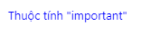

## III. CSS Priority Rankings (Độ ưu tiên của CSS)


CSS Priority Rankings là thứ tự ưu tiên các CSS được browser quy định, thông qua đó các bạn có thể biết đâu sẽ là thuộc tính được hiển thị trong trường hợp có sự xung đột CSS trên cùng một phần tử HTML.

Dưới dây là danh sách liệt kê thứ tự ưu tiên của thuộc tính CSS:


## **IV. Các đơn vị trong CSS**

**1. Đơn vị tương đối - Relative Units**
Đơn vị tương đối là đơn vị được tính một cách tương đối so với phần tử mẹ hoặc các phần tử khác. Đơn vị tương đối cơ động và hoạt động tốt hơn cho những thiết bị, những màn hình có kích thước và độ phân giải khác nhau.

Một số đơn vị tương đối chính được sử dụng trong CSS:

* **`%` (percentages)**: Đơn vị tương đối về kích thước của phần tử con so với phần tử mẹ (parrent). Ví dụ: Nếu phần tử mẹ có thuộc tính width:500px, phần tử con có thuộc tính width:50% thì có nghĩa là phần tử con có thuộc tính width:250px


* **`em`**: Là đơn vị tương đối dựa vào thuộc tính font-size của phần tử mẹ. Ví dụ: Nếu phần tử mẹ có thuộc tính font-size:16px, phần tử con có thuộc tính font-size:2em thì có nghĩa là phần tử con có thuộc tính font-size:32px
* **`rem`(root em)**: Là đơn vị tương đối dựa vào thuộc tính font-size của phần html (root element). Ví dụ: Nếu phần tử html có thuộc tính font-size:12px phần tử mẹ có thuộc tính font-size:16px, phần tử con có thuộc tính font-size:2rem thì có nghĩa là phần tử con có thuộc tính font-size:24px; Tức là đơn vị rem không phụ thuộc vào phần tử mẹ.

**2. Đơn vị tuyệt đối - Absolute Units**

Khác với đơn vị tương đối, như tên gọi, đơn vị tuyệt đối sẽ có những giá trị cố định không thay đổi. Đơn vị tuyệt đối không được khuyến khích sử dụng cho màn hình, vì có rất nhiều các kích thước màn hình khác nhau. Nó chỉ nên dùng cho những trường hợp biết chắc kích thước của giao diện, như xuất ra máy in chẳng hạn.

Một số đơn vị tuyệt đối được sử dụng trong CSS:

* px *: pixels (1px = 1/96th of 1in)
* pt: points (1pt = 1/72 of 1in)
* pc: picas (1pc = 12 pt)
* cm: centimeters
* mm: millimeters
* in: inches (1in = 96px = 2.54cm)

## **V. Float and Box model**

### 1. Float

Thuộc tính `float` được sử dụng để xác định cách hiển thị của phần tử.

Thuộc tính `float` có thể có các giá trị sau:

* `left` - Phần tử sẽ nổi bên trái
* `right` - Phần tử sẽ nổi bên phải
* `none` - Phần tử sẽ không nổi
* `inherit` - Phần tử sẽ kế thừa giá trị của phần tử cha

Ví dụ:

```CSS
img {
  float: right;
}
```

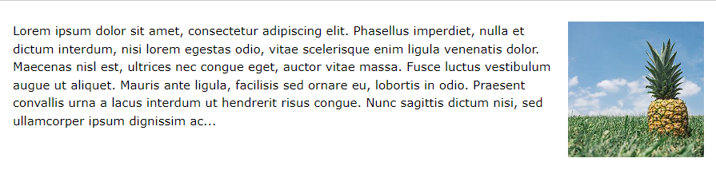

```CSS
img {
  float: left;
}
```

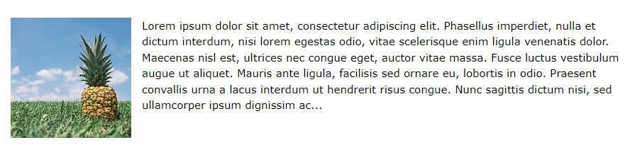

```CSS
img {
  float: none;
}
```

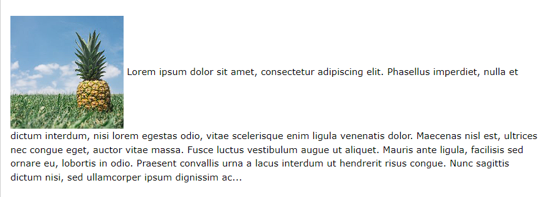

### 2. Box model

Box model có thể được coi là một cái hộp bao bọc xung quanh mỗi phần tử HTML. Nó bao gồm: `margin`, `border`, `padding`, và phần nội dung.

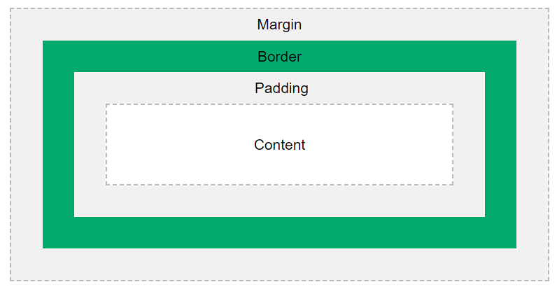

* `Content` - Phần nội dung của box, nơi hiển thị nội dung của phần tử HTML
* `Padding` - Phần đệm, nằm giữa phần nội dung và phần viền
* `Border` - Phần viền, nằm giữa phần đệm và phần margin
* `Margin` - Phần lề, nằm bên ngoài phần viền

Box model cho phép thêm viền xung quanh các phần tử HTML và điều chỉnh khoảng cách giữa các phần tử.

Ví dụ:

```CSS
div {
  width: 300px;
  border: 15px solid green;
  padding: 50px;
  margin: 20px;
}
```

**Chiều rộng và chiều cao của một phần tử**

Khi tính toán chiều rộng và chiều cao của một phần tử, bạn phải tính toán cả phần nội dung, phần đệm, phần viền và phần lề.

Ví dụ:

```CSS
div {
  width: 320px;
  padding: 10px;
  border: 5px solid gray;
  margin: 0;
}
```

Với ví dụ này, chiều rộng thực tế của phần tử được tính toán như sau:

```YML
320px (width)
+ 20px (left + right padding)
+ 10px (left + right border)
+ 0px (left + right margin)
= 350px
```

* Tổng chiều rộng của phần tử = width + left padding + right padding + left border + right border + left margin + right margin.
* Tổng chiều cao của phần tử = height + top padding + bottom padding + top border + bottom border + top margin + bottom margin.

## **VI. Position**

Thuộc tính `position` xác định cách hiển thị của phần tử.

Thuộc tính `position` có thể có các giá trị sau:

* `static` - Phần tử sẽ được hiển thị theo thứ tự mặc định
* `relative` - Phần tử sẽ được hiển thị theo vị trí tương đối với vị trí mặc định
* `fixed` - Phần tử sẽ được hiển thị theo vị trí tuyệt đối với vị trí màn hình
* `absolute` - Phần tử sẽ được hiển thị theo vị trí tuyệt đối với vị trí của phần tử cha
* `sticky` - Phần tử sẽ được hiển thị theo vị trí tương đối với vị trí màn hình

### 1. Static

Phần tử sẽ được hiển thị theo thứ tự mặc định.

Ví dụ:

```CSS
div.static {
  position: static;
  border: 3px solid #73AD21;
}
```

### 2. Relative

Phần tử sẽ được hiển thị theo vị trí tương đối với vị trí mặc định.

Thay đổi các thuộc tính top, right, bottom và left của phần tử sẽ làm cho phẩn tử thay đổi vị trí so với vị trí mặc định của phần tử.

Ví dụ:

```CSS
div.relative {
  position: relative;
  left: 30px;
  border: 3px solid #73AD21;
}
```

### 3. Fixed

Phần tử sẽ được hiển thị theo vị trí tuyệt đối với vị trí màn hình.

Nghĩa là, nó sẽ không di chuyển khi người dùng cuộn trang.

Ví dụ:

```CSS
div.fixed {
  position: fixed;
  bottom: 0;
  right: 0;
  width: 300px;
  border: 3px solid #73AD21;
}
```

### 4. Absolute

Phần tử sẽ được hiển thị theo vị trí tuyệt đối với vị trí của phần tử cha.

**Chú ý:**

* Nếu không có phần tử cha nào, nó sẽ được hiển thị theo vị trí tuyệt đối với vị trí của thẻ `<html>`, và sẽ di chuyển khi người dùng cuộn trang.
* Phần tử có vị trí **absolute** có thể ghi đè lên các phần tử khác.

Ví dụ:

```CSS
div.relative {
  position: relative;
  width: 400px;
  height: 200px;
  border: 3px solid #73AD21;
}

div.absolute {
  position: absolute;
  top: 80px;
  right: 0;
  width: 200px;
  height: 100px;
  border: 3px solid #73AD21;
}
```

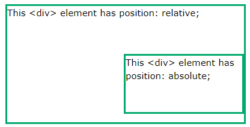

### 5. Sticky

Phần tử với vị trí **sticky**, vị trí sẽ phụ thuộc vào vị trí cuộn tranh của người dùng.

Nó sẽ di chuyển đến một ngưỡng nhất định khi người dùng cuộn trang.

Ví dụ:

```CSS
div.sticky {
  position: -webkit-sticky; /* Safari */
  position: sticky;
  top: 0;
  background-color: green;
  border: 2px solid #4CAF50;
}
```

Ở ví dụ này, phần tử sticky được cài đặt với `top: 0`, sẽ dừng lại ở đầu trang khi người dùng cuộn trang.

## **VII. Z-index**

Thuộc tính `z-index` xác định thứ tự hiển thị của phần tử.

Nếu các phần tử có cùng vị trí, thì phần tử có `z-index` lớn hơn sẽ được hiển thị trước.

Ví dụ:

```CSS
<html>
<head>
<style>
.container {
  position: relative;
}

.black-box {
  position: relative;
  z-index: 1;
  border: 2px solid black;
  height: 100px;
  margin: 30px;
}

.gray-box {
  position: absolute;
  z-index: 3;
  background: lightgray;
  height: 60px;
  width: 70%;
  left: 50px;
  top: 50px;
}

.green-box {
  position: absolute;
  z-index: 2;
  background: lightgreen;
  width: 35%;
  left: 270px;
  top: -15px;
  height: 100px;
}
</style>
</head>
<body>

<div class="container">
  <div class="black-box">Black box</div>
  <div class="gray-box">Gray box</div>
  <div class="green-box">Green box</div>
</div>

</body>
</html>
```

`z-index` có thể nhận giá trị âm hoặc dương.

## **VIII. Display**

Thuộc tính `display` xác định kiểu hiển thị của phần tử.

Thuộc tính `display` có thể có các giá trị sau:

* `inline` - Hiển thị phần tử như một phần tử `inline` (như `<span>`). Bất kỳ chiều rộng và chiều cao nào cũng không có hiệu lực.
* `block` - Hiển thị phần tử như một phần tử `block` (như `<p>`). Bất kỳ chiều rộng và chiều cao nào cũng có hiệu lực.
* `inline-block` - Hiển thị phần tử như một phần tử `inline` (như `<span>`), nhưng có thể có chiều rộng và chiều cao.
* `none` - Phần tử sẽ không được hiển thị.
* `hidden` - Phần tử sẽ không được hiển thị, nhưng vẫn chiếm diện tích trên trang.

## **IX. Background style**

Nền của một phần tử có thể được định dạng bằng cách sử dụng các thuộc tính sau:

* `background-color`
* `background-image`
* `background-repeat`
* `background-attachment`
* `background-position`

### 1. Background-color

Thuộc tính `background-color` xác định màu nền của một phần tử.

Ví dụ:

```CSS
body {
  background-color: lightblue;
}
```

### 2. Background-image

Thuộc tính `background-image` xác định hình ảnh nền của một phần tử.

Ví dụ:

```CSS
body {
  background-image: url("paper.gif");
}
```

### 3. Background-repeat

Thuộc tính `background-repeat` xác định xem hình nền có được lặp lại (repeated) hoặc không.

Ví dụ:

```CSS
body {
  background-image: url("gradient_bg.png");
  background-repeat: repeat-x;
}
```

Trong ví dụ này, ảnh nền sẽ được lặp lại và phủ kín trục x, hay chiều ngang của trang web.

### 4. Background-attachment

Thuộc tính `background-attachment` xác định xem hình nền có được cuộn (scrolled) hay không.

Ví dụ:

```CSS
body {
  background-image: url("img_tree.png");
  background-repeat: no-repeat;
  background-position: right top;
  background-attachment: fixed;
}
```

Trong ví dụ này, ảnh nền sẽ được cố định và không cuộn khi người dùng cuộn trang.

### 5. Background-position

Thuộc tính `background-position` xác định vị trí bắt đầu của hình nền.

Ví dụ:

```CSS
body {
  background-image: url("img_tree.png");
  background-repeat: no-repeat;
  background-position: right top;
}
```

Trong ví dụ này, ảnh nền sẽ được đặt ở góc trên bên phải của trang web.

## **X. Pseudo-class và Pseudo-element**

### 1. Pseudo-class

Pseudo-class là một từ khóa được thêm vào chọn lọc, để chỉ định một trạng thái đặc biệt của phần tử được chọn.

Cú pháp:

```CSS
selector:pseudo-class {
  property:value;
}
```

Ví dụ:

```CSS
/* unvisited link */
a:link {
  color: #FF0000;
}

/* visited link */
a:visited {
  color: #00FF00;
}

/* mouse over link */
a:hover {
  color: #FF00FF;
}

/* selected link */
a:active {
  color: #0000FF;
}
```

**Chú ý:** `:hover` phải đặt sau `:link` và `:visited` (nếu có) trong khai báo CSS để có hiệu lực. `:active` phải đặt sau `:hover` mới có hiệu lực.

**`:first-child` Pseudo-class**

Pseudo-class `:first-child` được sử dụng để chọn phần tử đầu tiên của một phần tử cha.

Ví dụ chọn phần tử `<p>` đầu tiên của bất kì phần tử nào:

```CSS
p:first-child {
  color: blue;
}
```

### 2. Pseudo-element

Pseudo-element là một từ khóa được thêm vào chọn lọc, để chỉ định một phần của phần tử được chọn.

Cú pháp:

```CSS
selector::pseudo-element {
  property:value;
}
```

**`::first-line` Pseudo-element**

Pseudo-element `::first-line` được sử dụng để định dạng dòng đầu tiên của một phần tử.

Ví dụ chọn dòng đầu tiên của tất cả các phần tử `<p>`:

```CSS
p::first-line {
  color: #ff0000;
  font-variant: small-caps;
}
```

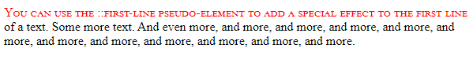

**Chú ý:** `::first-line` chỉ có thể được sử dụng với phần tử `block-level` (như `<p>`).

Các thuộc tính sau có thể được sử dụng để định dạng dòng đầu tiên:

* `font`
* `color`
* `background`
* `margin`
* `padding`
* `border`
* `text-decoration`
* `vertical-align`
* `text-transform`
* `line-height`
* `float`
* `clear`

**`::first-letter` Pseudo-element**

Pseudo-element `::first-letter` được sử dụng để định dạng chữ cái đầu tiên của một phần tử.

Ví dụ chọn chữ cái đầu tiên của tất cả các phần tử `<p>`:

```CSS
p::first-letter {
  color: #ff0000;
  font-size: xx-large;
}
```

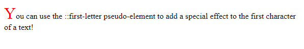

**`::before` Pseudo-element**

Pseudo-element `::before` được sử dụng để chèn một nội dung vào phần tử được chọn.

Ví dụ chèn nội dung vào phần tử `<h1>`:

```CSS
h1::before {
  content: url(smiley.gif);
}
```

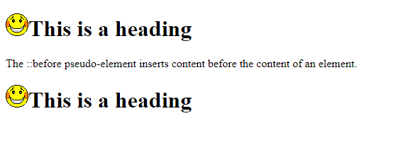

**`::after` Pseudo-element**

Pseudo-element `::after` được sử dụng để chèn một nội dung vào phần tử được chọn.

Ví dụ chèn nội dung vào phần tử `<h1>`:

```CSS
h1::after {
  content: url(smiley.gif);
}
```

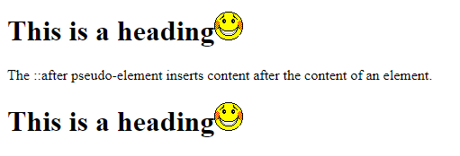

**`::marker` Pseudo-element**

Pseudo-element `::marker` được sử dụng để định dạng ký hiệu của một phần tử danh sách.

Ví dụ chọn ký hiệu của tất cả các phần tử `<li>`:

```CSS
li::marker {
  font-size: 20px;
  color: red;
}
```

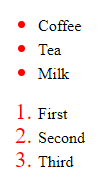

**`::selection` Pseudo-element**

Pseudo-element `::selection` được sử dụng để định dạng phần văn bản được chọn.

Ví dụ chọn phần văn bản được chọn:

```CSS
::selection {
  color: red;
  background: yellow;
}
```

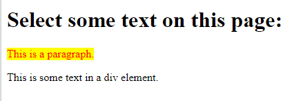

## **XI. Text styling**

### 1. Text color

Thuộc tính `color` xác định màu chữ cho phần tử.

Màu có thể được xác định bằng:

* Tên màu - như "red"
* Mã màu HEX - như "#ff0000"
* Giá trị RGB - như "rgb(255,0,0)"

**Text Color và Background Color**

```CSS
body {
  background-color: lightgrey;
  color: blue;
}

h1 {
  background-color: black;
  color: white;
}

div {
  background-color: blue;
  color: white;
}
```

### 2. Text alignment

Thuộc tính `text-align` xác định căn chỉnh văn bản của phần tử.

Căn chỉnh văn bản có thể là:

* `left` - căn lề văn bản về bên trái
* `right` - căn lề văn bản về bên phải
* `center` - căn lề văn bản về giữa
* `justify` - căn lề văn bản về đều hai bên

**Text Alignment**

```CSS
h1 {
  text-align: center;
}

p {
  text-align: justify;
}
```

### 3. Text decoration

Thuộc tính `text-decoration` xác định trang trí văn bản của phần tử.

Trang trí văn bản có thể là:

* `text-decoration-line`
* `text-decoration-color`
* `text-decoration-style`
* `text-decoration-thickness`
* `text-decoration`

**`text-decoration-line`**

Thuộc tính `text-decoration-line` xác định loại trang trí văn bản.

Loại trang trí văn bản có thể là:

* `none` - không có trang trí văn bản
* `underline` - một đường gạch chân dưới văn bản
* `overline` - một đường gạch trên văn bản
* `line-through` - một đường gạch ngang qua văn bản
* `underline overline` - một đường gạch chân dưới và một đường gạch trên văn bản

**`text-decoration-color`**

Thuộc tính `text-decoration-color` xác định màu sắc của trang trí văn bản.

**`text-decoration-style`**

Thuộc tính `text-decoration-style` xác định kiểu của trang trí văn bản.

Kiểu trang trí văn bản có thể là:

* `solid` - đường gạch liền
* `double` - đường gạch đôi
* `dotted` - đường gạch chấm
* `dashed` - đường gạch nối
* `wavy` - đường gạch sóng
* `initial` - thiết lập kiểu trang trí văn bản về giá trị ban đầu
* `inherit` - kế thừa kiểu trang trí văn bản từ phần tử cha

**`text-decoration-thickness`**

Thuộc tính `text-decoration-thickness` xác định độ dày của trang trí văn bản.

Độ dày của trang trí văn bản có thể là:
